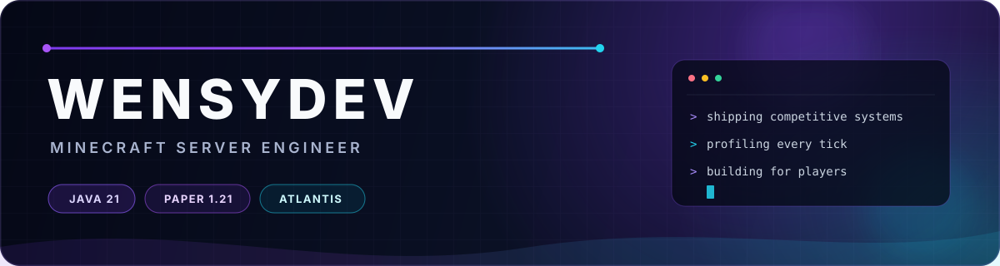

<div align="center">
  
</div>

<div align="center">
  <h3>Building fast, stable and memorable Minecraft experiences.</h3>
  <p>
    Java engineer focused on competitive game modes, server infrastructure<br/>
    and production systems for the <strong>ATLANTIS</strong> ecosystem.
  </p>
</div>

<br/>

## What I build

| Area | Focus |
| :--- | :--- |
| **Competitive gameplay** | Meetups, FFA, Practice and other PvP-first experiences |
| **Server engineering** | Paper 1.21.x plugins, packet-level systems and safe integrations |
| **Performance** | Profiling, tick-time reduction, memory efficiency and stable networking |
| **Infrastructure** | Velocity networks, Pterodactyl deployments and SQL-backed services |

## Current toolbelt

<p align="center">
  
  
  
  
  
</p>

## Engineering principles

```text
performance is a feature  •  gameplay comes first  •  measure before tuning
safe deployments          •  clean ownership       •  predictable systems
```

<div align="center">
  <sub>Most production work lives in private repositories. The craft stays visible; the infrastructure stays protected.</sub>
</div>
